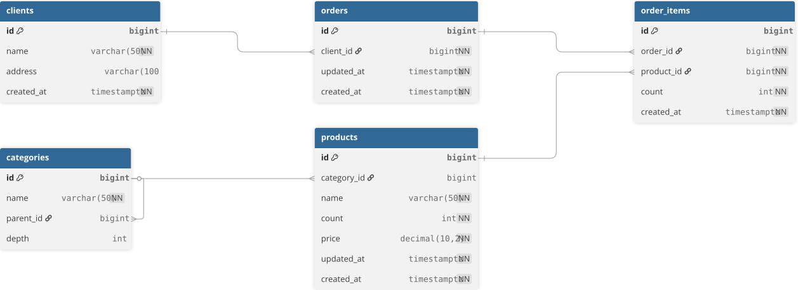

# Тестовый сервис

### Представляет coбой тестовый асинхронный FastAPI сервер(магазин товаров)

## Запуск проекта

В терминале из корня проекта выполнить команду:

- **Для разработки (dev):**

```bash
  ENV=dev uvicorn main:shop_app --reload
```
- **Для разработки (prod):**
```bash
  ENV=prod uvicorn main:shop_app --reload
```

## Database schema

[](https://dbdiagram.io/d/shop-69820089bd82f5fce27fa965)

## SQL Запросы, пункт 2(также для них созданы отдельные эндпойнты).

### 2.1
```sql
    SELECT
        c.name AS client_name,
        SUM(oi.count * p.price) AS total_sum
    FROM clients c
             JOIN orders o
                  ON o.client_id = c.id
             JOIN order_items oi
                  ON oi.order_id = o.id
             JOIN products p
                  ON p.id = oi.product_id
    GROUP BY c.name
    ORDER BY c.name
```

### 2.2
```sql
WITH RECURSIVE parent AS (
        SELECT
            c.id,
            c.name,
            c.depth,
            c.id AS root_id,
            NULL::text AS root_name
        FROM categories c
        WHERE parent_id IS NULL

        UNION ALL

        SELECT
            c.id,
            c.name,
            c.depth,
            p.id AS root_id,
            p.name AS root_name
        FROM categories c
                 JOIN parent p ON c.parent_id = p.id
    )

    SELECT
        p.name,
        COUNT(ch.id) AS count_child,
        MIN(p.depth) AS depth
    FROM parent p
             LEFT JOIN categories ch
                       ON ch.parent_id = p.id
    GROUP BY p.id, p.name, p.root_name
    ORDER BY p.id
```

### 2.3.1
```sql
CREATE OR REPLACE VIEW report_view AS
        WITH RECURSIVE category_tree AS (
            SELECT id, name, parent_id, name AS root_name
            FROM categories
            WHERE depth = 1
        
            UNION ALL
        
            SELECT c.id, c.name, c.parent_id, ct.root_name
            FROM categories c
            JOIN category_tree ct ON c.parent_id = ct.id
        ),
        sales_last_month AS (
            SELECT
                p.name,
                ct.root_name AS main_category,
                SUM(oi.count) AS total_count,
                DENSE_RANK() OVER (ORDER BY SUM(oi.count) DESC) AS rank
            FROM order_items oi
            JOIN products p ON p.id = oi.product_id
            JOIN category_tree ct ON ct.id = p.category_id
            WHERE oi.created_at >= date_trunc('month', now())
            GROUP BY p.name, ct.root_name
        )
        SELECT *
        FROM sales_last_month
        WHERE rank <= 5
        ORDER BY rank
```

## 📚 API Documentation

После запуска проекта документация доступна:

- Swagger UI: http://localhost:8000/docs
- ReDoc: http://localhost:8000/redoc
- OpenAPI schema: http://localhost:8000/openapi.json

## 🐳 Команды для сборки проекта в Docker

### 📦 Сборка контейнеров

- **Для dev:**

```bash
  sudo ENV=dev docker compose up --build -d
```

- **Для prod:**

```bash
  sudo ENV=prod docker compose up --build -d
```

## 🧪 Запуск тестов (FastAPI)

### ▶️ Запуск тестов локально

```bash
pytest - v
```